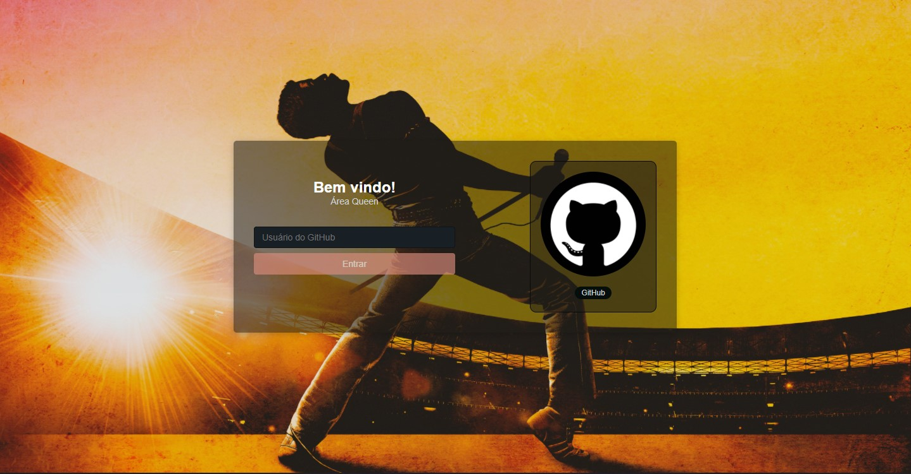
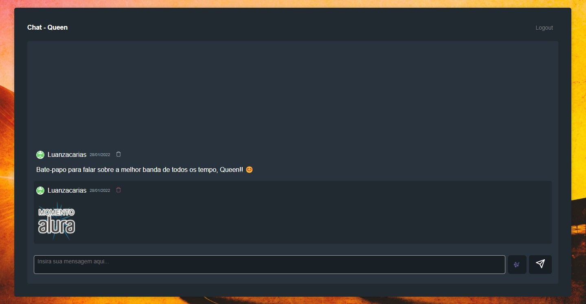

# Aluracord 

- Projeto desenvolvido durante a Imersão React (21/01/2021 -- 31/01/2021), proporcioando pela [Alura](https://alura.com.br/).

## Professores:

- [Mario Souto](https://github.com/omariosouto);
- [Paulo Silveira](https://github.com/peas);
- Outros contribuidores: [aqui](https://github.com/alura-challenges/aluracord-matrix).

## Projeto
- Você faz entra com a sua conta do GitHub e pode conversar com várias outras pessoas no chat, sobre o assunto que quiserem!
- Clique [aqui](https://aluracord-queen.vercel.app/) para acessar o projeto na web.



## Tecnologias usadas
- React;
- Next.js;
- skynexui.

## Getting Started

Rode no seu server de desenvolvimento:

```bash
npm run dev
# or
yarn dev
```

Abra http://localhost:3000 no seu browser para ver o resultado.

## Extras
- [Supabase](https://supabase.com/) foi usado como o banco de dados para o projeto.
- Projeto hospedado no [Vercel](https://vercel.com).
